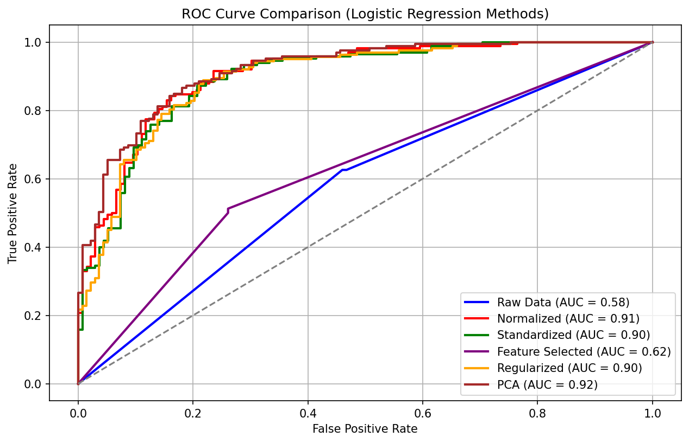

# Cardiovascular Disease Risk Prediction

A logistic regression model that estimates a patient's likelihood of heart disease from 13 clinical bioindicators, plus a small companion app that turns the model's most influential features into plain-language lifestyle guidance.

The core classifier is implemented **from scratch in NumPy** (sigmoid hypothesis, cross-entropy cost, batch gradient descent, manual 10-fold cross-validation) and benchmarked against scikit-learn baselines across several preprocessing strategies.



---

## Highlights

- **Custom logistic regression** — gradient descent, log-loss, and L2 penalty written by hand rather than calling `LogisticRegression.fit()`
- **Preprocessing comparison** — raw vs. min-max normalized vs. z-score standardized inputs, plus scikit-learn regularized and PCA variants
- **Manual 10-fold cross-validation** with pooled out-of-fold predictions for ROC/AUC
- **Educational CLI** that flags out-of-range vitals against the population and prints targeted health suggestions

## Results

AUC from 10-fold cross-validation on 303 patients, across four random shuffles:

| Method | AUC | Notes |
|---|---|---|
| Raw features | 0.56 – 0.63 | Unscaled inputs make gradient descent unstable |
| Min-max normalized | **0.90 – 0.91** | Best custom-model result |
| Z-score standardized | 0.88 – 0.90 | |
| Regularized (scikit-learn, C = 10) | 0.89 – 0.90 | Baseline for comparison |
| PCA (5 components) + logistic regression | 0.92 | Evaluated in-sample — see limitations |

**Takeaway:** feature scaling is the single biggest factor. Moving from raw to scaled inputs lifts AUC by roughly 30 points, and the from-scratch model matches scikit-learn's regularized solver once the data is scaled.

## Dataset

[Heart Disease dataset on Kaggle](https://www.kaggle.com/datasets/data855/heart-disease), derived from the UCI Cleveland Heart Disease database.

- **303 patients**, 13 features, binary `target` (165 positive / 138 negative), no missing values
- The original UCI database has 76 attributes, but published work uses the same 14-attribute subset used here

| Feature | Description |
|---|---|
| `age` | Age in years |
| `sex` | 1 = male, 0 = female |
| `cp` | Chest pain type (0–3) |
| `trestbps` | Resting blood pressure (mm Hg) |
| `chol` | Serum cholesterol (mg/dl) |
| `fbs` | Fasting blood sugar > 120 mg/dl (1 = true) |
| `restecg` | Resting ECG result (0–2) |
| `thalach` | Maximum heart rate achieved |
| `exang` | Exercise-induced angina (1 = yes) |
| `oldpeak` | ST depression induced by exercise relative to rest |
| `slope` | Slope of the peak exercise ST segment (0–2) |
| `ca` | Number of major vessels colored by fluoroscopy |
| `thal` | Thalassemia test result |

## How It Works

### 1. Risk prediction model
`src/Cardiovascular Disease Risk Prediction Model.py`

1. Load `heart.csv` and separate features from `target`
2. Apply one preprocessing strategy (raw, normalize, standardize, regularized, or PCA)
3. Prepend a bias column and shuffle
4. Train with batch gradient descent (α = 0.1, 5,000 iterations) on each of 10 folds
5. Pool out-of-fold probabilities, compute ROC/AUC, and plot all methods on one chart

### 2. Educational UI
`src/Educational_UI.py`

The five features with the largest-magnitude weights from the normalized model — `slope`, `thal`, `trestbps`, `exang`, and `ca` — drive a simple command-line tool:

1. The user enters values for those five indicators
2. Each value is z-scored against the dataset
3. Any value more than one standard deviation from the mean is flagged
4. The app prints lifestyle suggestions matched to each flagged indicator

## Getting Started

```bash
git clone https://github.com/gkannan-codes/Cardiovascular-Disease-Prediction-Model.git
cd Cardiovascular-Disease-Prediction-Model
pip install numpy pandas matplotlib scikit-learn
```

Both scripts load `heart.csv` from the working directory, so run them from `data/raw`:

```bash
cd data/raw
python "../../src/Cardiovascular Disease Risk Prediction Model.py"   # trains models, shows ROC plot
python ../../src/Educational_UI.py                                    # interactive health check
```

The scripts also use `# %%` cell markers, so they can be run cell by cell in VS Code or Spyder.

## Project Structure

```
├── data/
│   └── raw/
│       └── heart.csv                                    # Dataset
├── src/
│   ├── Cardiovascular Disease Risk Prediction Model.py  # Training, CV, ROC comparison
│   └── Educational_UI.py                                # Interactive suggestion tool
└── README.md
```

## Limitations & Future Work

- **Small dataset.** 303 patients from a single source limits how far the results generalize.
- **PCA is scored in-sample.** The PCA variant trains and evaluates on the same data, so its AUC is optimistic. Moving it inside the cross-validation loop would make it comparable to the others.
- **Feature selection is currently a no-op.** RFE is asked for 20 features but the dataset has 13, so all are kept; the "feature selected" run is effectively the raw run.
- **Leakage in scaling.** Normalization and standardization use statistics from the full dataset before splitting; fitting them per fold would be cleaner.
- **Weights are hardcoded in the UI.** The educational app uses weights copied from one training run instead of loading a saved model.
- **Planned:** a saved model artifact, a `requirements.txt`, a web front end, and richer personalized guidance (potentially via an LLM) based on a wider set of inputs.

## Disclaimer

This is an educational machine learning project, not a medical device. Its predictions and suggestions are not a diagnosis and should not replace advice from a qualified healthcare professional.

## Acknowledgements

Dataset creators:
- Hungarian Institute of Cardiology, Budapest — Andras Janosi, M.D.
- University Hospital, Zurich — William Steinbrunn, M.D.
- University Hospital, Basel — Matthias Pfisterer, M.D.
- V.A. Medical Center, Long Beach and Cleveland Clinic Foundation — Robert Detrano, M.D., Ph.D.
